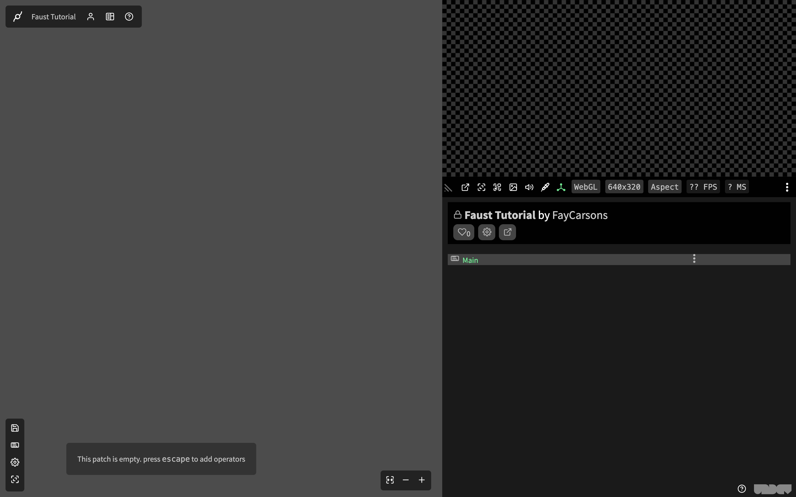
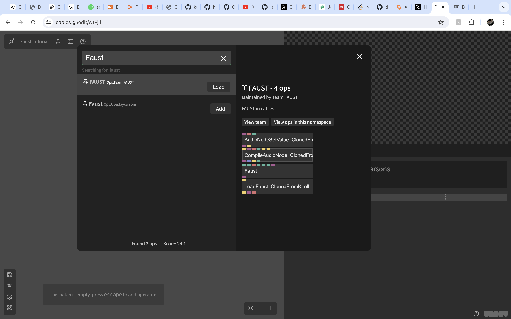
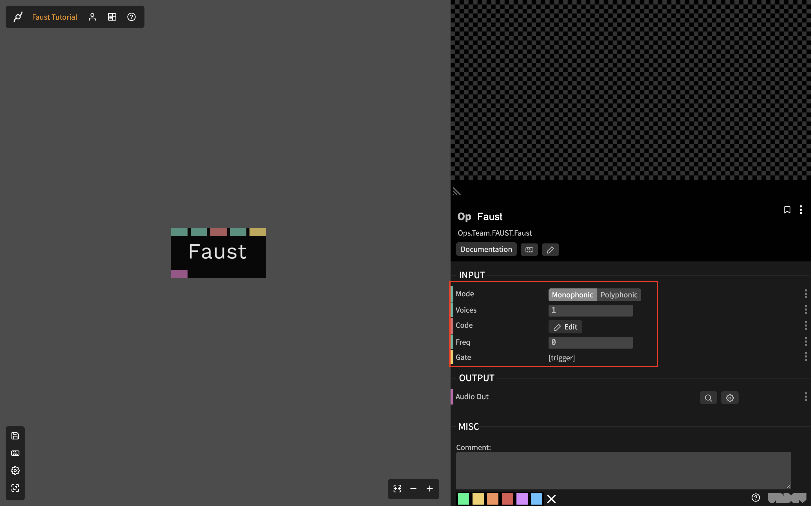
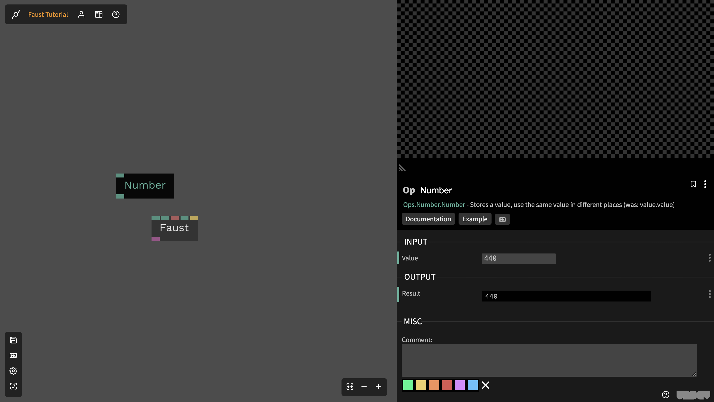
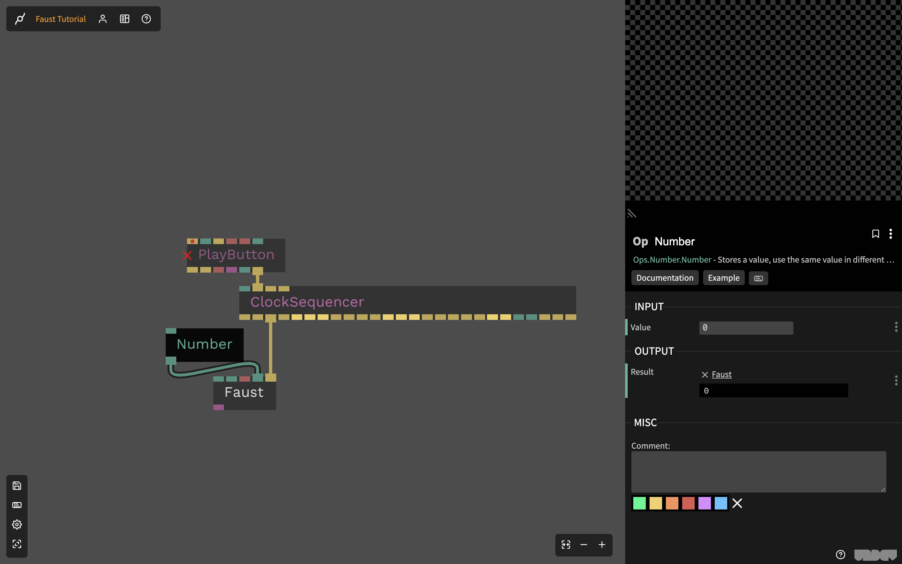

# Getting started with Faust and Cables.gl

This tutorial aims for to be a comprehensive guide to using the Faust operators for 
those that are potentially unfamiliar with Cables.gl and the Faust programming language.

## Glossary
- Operator - A Cables.gl operator, this is the basic unit of a Cables.gl project.
  For example there are number operators and arithmetic operators, you can connect 
  two number operators into the incoming ports of the addition operator, and the 
  computed result will be output on the addition operator's outgoing port 
- Port - an input/output port on an operator, this is how operators pass values.
  Ports can send or receive any JavaScript type, and connections are visually represented 
  as cables.

## Getting started 

Your first step is going to the [Cables.gl website](cables.gl), creating an 
account(top right corner) and a new patch (top middle after you log in).
Choose the 'empty patch' option. You should now have an empty patch: 

To get started add the Faust operator to your patch: press `esc` and a dialog will 
appear, prompting you to choose an operator. Type 'Faust' in the search bar of
this dialog and you should see this operator:

Double click this option. A Faust operator will be placed in your patch,
click on that operator to bring up its settings:

Let's break down what's going on here:
- Mode: This controls whether the operator is acting in monophonic mode 
  (one note at a time) or polyphonic mode 
  (MIDI-driven synths with the ability to play many overlapping notes at once)
- Voices: The number of voices in polyphonic mode, it has no effect on monophonic mode
  and is greyed out.
- Code: The Faust program that this operator is running, you can click the 'edit'
  button and a (minimal) text-editor will pop up with the default Faust script.
  This is where the behavior of the operator is ultimately set, Faust parameters 
  will become input and output ports.
- Freq & gate: These are parameters for this specific Faust script - pitch and a 
  trigger to articulate notes. When you replace the default script with 
  your own, the parameters you use will pop up here and on the operator's GUI.

## Making sounds!

The Faust operator is, generally, not going to be enough to achieve what you want
on its own. You need control signals, like numbers for pitch, triggers to trigger notes, 
or external audio sources to process. In cables.gl, this comes in the form of operators.
Our next step is populating your patch with some operators that will let you make sound 
with the Faust operator.

Start by opening the operator menu (`esc`), and typing `number` in the search bar.
This should bring up the number op with a little `add` button to its right. Click it.
Your patch should now look something like this: 

Click on the number op, and in the sidebar you should see a field labeled `value`, set it to 440.
Now connect the bottom port of the number op to the `freq` port of the Faust op so it looks 
like this: 

You are now, technically, are controlling the pitch of your Faust patch - but you won't 
hear anything. That's for two reasons, the first: you need a trigger to tell it to actually 
play a note. And the second: cables won't let you play audio until you click a special button.
I'll explain this by fixing the problem - go back to the operator menu and search for the 
`playButton` and `clockSeqeuncer`, adding them both to your patch. Now, connect them so that 
they look like this:

You should see a big play button in the sidebar of your patch, click it and you should hear one 
note playing, over and over. This is the `clockSequencer` triggering the Faust op's `gate` parameter
which is "pinging" our current DSP program.

In the next section we'll go over how you can make this a bit more interesting. Though I 
encourage you to experiment by yourself first - some helpful hints:
- You can build a sequencer out of numbers and clock divisions (like the ones supplied by `clockSequencer`).
  the `switchNumberOnTrigger` op can help you with this.
- Timbral changes are also possible, try creating your own parameter and incorporating it into the patch.
  A `gain` parameter that multiplies the signal somewhere before the final block (`ma.tanh`) will 
  introduce some distortion.
- When lost, randomness is always your friend in generative sequencing, the `RandomNumber` and `RandomTrigger`
  ops can add some variance and unpredictability to your patch.
